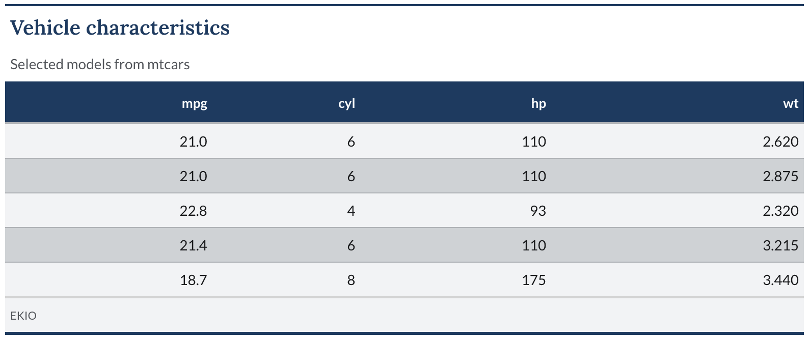

<!-- README.md is generated from README.Rmd. Please edit that file -->

```{r, include = FALSE}
knitr::opts_chunk$set(
  collapse = TRUE,
  comment = "#>",
  fig.path = "man/figures/README-",
  out.width = "100%"
)
```
# ekiotable

ekiotable applies the EKIO visual identity to [gt](https://gt.rstudio.com)
tables.

[ekioplot](https://github.com/viniciusoike/ekioplot) provides EKIO color scales.
ekiotable reads those scales through `ekioplot::ekio_pal()` and keeps pinned
copies of the basic and brand tokens in `R/tokens.R`. Titles use Lora and
body text uses Lato by default, matching charts made with ekioplot.

## Installation

ekiotable and its only non-CRAN dependency, ekioplot, ship from the
[viniciusoike r-universe](https://viniciusoike.r-universe.dev). Neither
package is on CRAN, since CRAN only accepts hard dependencies that are
themselves on CRAN. The command below installs ekiotable.

```r
install.packages(
  "ekiotable",
  repos = c("https://viniciusoike.r-universe.dev", "https://cloud.r-project.org")
)
```

`install.packages()` resolves `ekioplot` from the same universe
automatically.

## Usage

```r
library(gt)
library(ekiotable)

head(mtcars, 10) |>
  gt() |>
  gt_theme_ekio()
```

`gt_theme_ekio()` styles headers, column labels, row groups, summary rows,
stubs, source notes, and footnotes. It also adds an EKIO source note by
default.

```r
gt_theme_ekio(tbl, table_width = "80%", font_size = 12, stripe = FALSE, add_footer = FALSE)
```

## Relationship to ekioplot

| Package | Scope |
|---|---|
| [ekioplot](https://github.com/viniciusoike/ekioplot) | Brand tokens, ggplot2 themes, scales, palettes, chart recipes |
| ekiotable | gt table styling |

To change a brand color, edit `inst/ekio-palettes.yaml` in ekioplot and
rerun its `data-raw/palettes.R`. ekiotable picks scale changes up through
`ekioplot::ekio_pal()`. Update the pinned basic and brand tokens in
`R/tokens.R` separately when they change upstream.

## Fonts

Set fonts with `font_title`, `font_body`, `font_numeric`, and `font_labels`.
Each accepts a family name or a key: `lora`, `lato`, `georgia`, `roboto_slab`,
`fira_code`, or `host_grotesk`. Fonts must be available to the renderer.

```r
gt_theme_ekio(tbl, font_title = "georgia", font_numeric = "fira_code")
```

Arguments override `ekiotable.font_title`, `ekiotable.font_body`,
`ekiotable.font_numeric`, and `ekiotable.font_labels` options. Title and body
then fall back to `ekioplot.font_title` and `ekioplot.font_text`, followed by
Lora and Lato. Numeric and label fonts inherit the resolved body font.

```{r example-table, echo=FALSE, message=FALSE, fig.alt="EKIO table with a serif title, blue column labels, and alternating gray rows."}
devtools::load_all(quiet = TRUE)
example_table <- gt::gt(head(mtcars[c("mpg", "cyl", "hp", "wt")], 5)) |>
  gt::tab_header(
    title = "Vehicle characteristics",
    subtitle = "Selected models from mtcars"
  ) |>
  gt_theme_ekio()
dir.create("man/figures", recursive = TRUE, showWarnings = FALSE)
invisible(capture.output(
  gt::gtsave(
    example_table,
    "man/figures/README-example-table.png",
    vwidth = 800
  )
))

```
